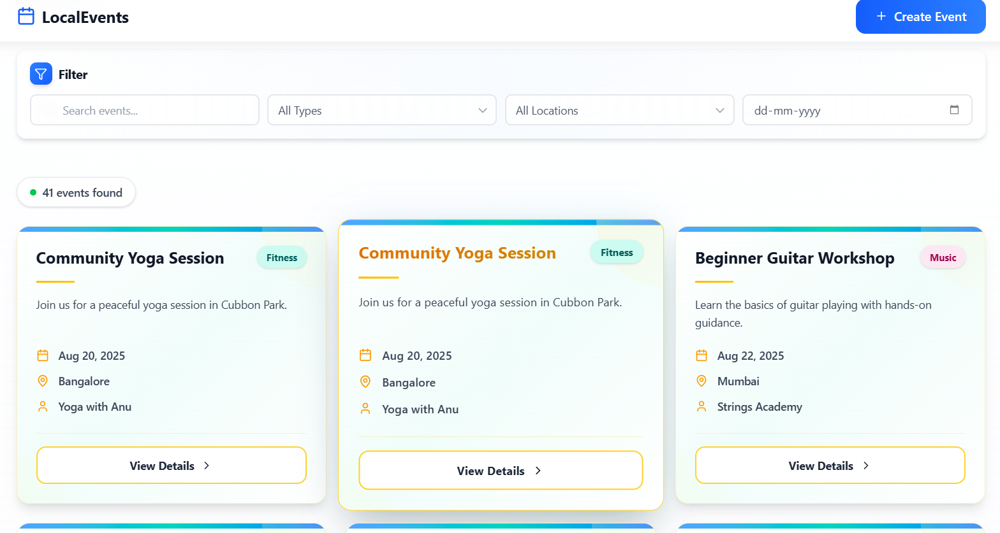
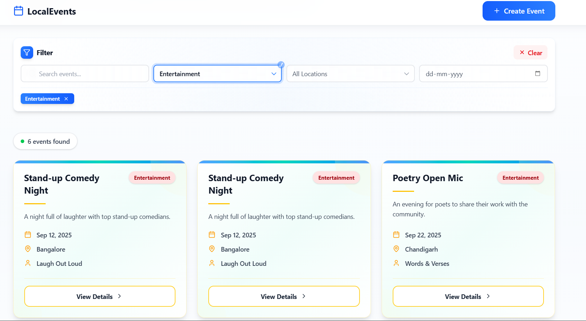
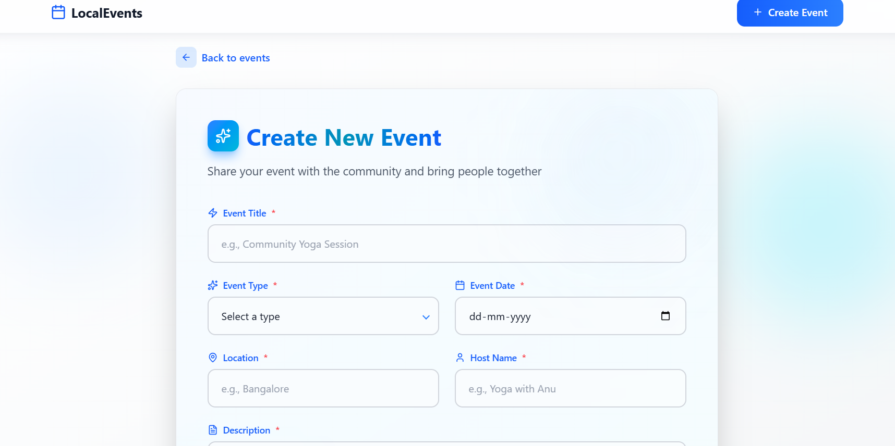
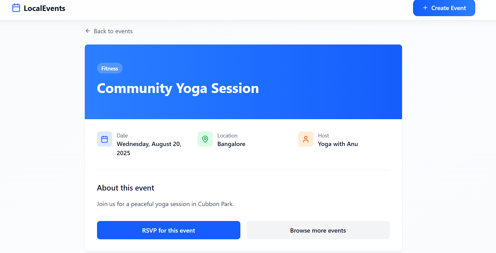

# localevents
way to join your local fests
# 🎉 LocalEvents

It is a modern web application built with **TypeScript, React, Supabase, and TailwindCSS** that helps people discover, create, and join local events with smooth animations and a beautiful user interface.

Whether you're hosting a meetup, workshop, or social gathering — EventConnect makes it easy to connect with your community.

---

## 🚀 Features


- 📍 Create Local Events
- 🎟 Join Events
- 👥 View Event Attendees
- 🎨 Smooth UI Animations
- 📱 Fully Responsive Design
- ⚡ Fast and Modern UI with TailwindCSS
- 🔄 Real-time updates powered by Supabase

---

## 🛠 Tech Stack

- **Frontend:** React + TypeScript
- **Styling:** TailwindCSS
- **Backend & Database:** Supabase
- **Animations:** (CSS animations)

---

## 📸 Screenshot







## 📦 Installation & Setup Guide

Follow these steps to run the project locally:
npm i - install modules
npm run dev - to start script

### 1️⃣ Clone the Repository

```bash
git clone https://github.com/NayanshreeTripathi/localevents
cd localevents
